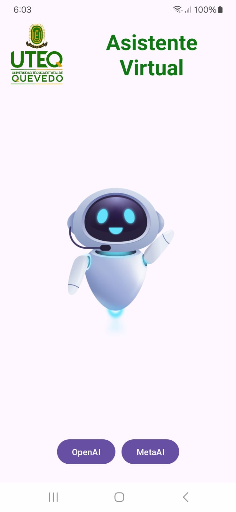
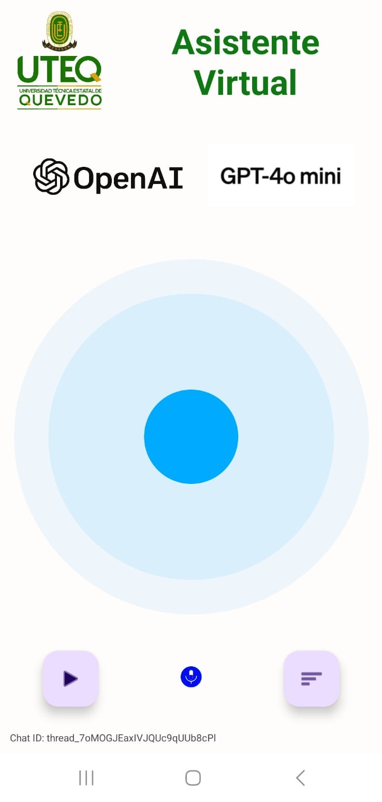
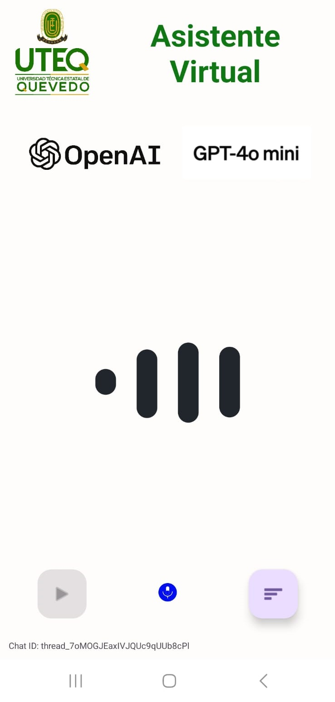
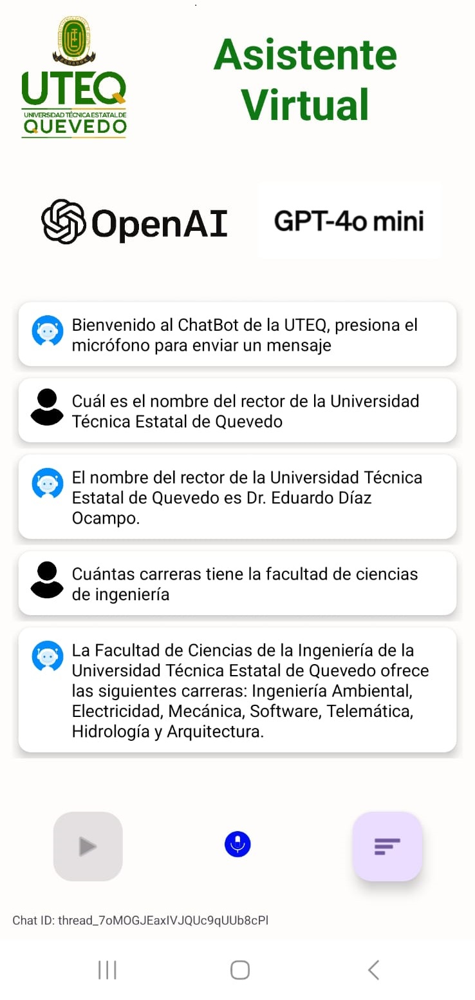

# UTEQ Virtual Assistant

This project is an Android application for the State Technical University of Quevedo (UTEQ) that uses ChatGPT for a virtual assistant. The app allows users to interact with a chatbot through voice commands, utilizing Speech Recognition and Text-to-Speech features. The assistant provides responses to users' questions related to the university and other queries.

## Features

- **Voice Interaction**: Users can interact with the assistant by speaking into the microphone.
- **Real-time Chat Display**: The app displays the conversation history in a chat-like interface.
- **Text-to-Speech Response**: The assistant responds audibly to the user.
- **Animations**: Includes visual animations for microphone and response feedback.

## Main Components

- **Speech Recognition**: Listens to user voice input and converts it into text.
- **Text-to-Speech**: Converts text responses from the assistant into audio output.
- **API Integration with ChatGPT**: Uses ChatGPT API to process and respond to user queries.
- **RecyclerView for Message Display**: Displays conversation history in a chat format.
- **Permissions Handling**: Requests and manages audio recording permissions for voice interactions.

## Screenshots
### Start Screen


### Listening Mode


### Speaking Mode

### Message Display



## How It Works

1. **Initialization**: The app initializes `SpeechRecognizer` and `TextToSpeech` components and requests audio recording permissions if not already granted.
2. **Listening to User Input**: Upon pressing the microphone button, the app starts listening to the user's voice input.
3. **Processing the Input**: The recognized text is displayed in the chat interface and sent to the ChatGPT API for processing.
4. **Displaying and Speaking the Response**: The assistant's response is displayed in the chat and spoken aloud using the Text-to-Speech engine.

## Key Classes and Methods

- **MainActivity**: Handles UI initialization, voice input, API requests, and response handling.
    - **createThread**: Initiates a new conversation thread with the ChatGPT API.
    - **createMessage**: Sends the user’s query to the ChatGPT API.
    - **runMessage**: Executes the conversation with the ChatGPT API.
    - **checkRunStatusPeriodically**: Checks the status of the ChatGPT response periodically.
    - **getFinalMessage**: Retrieves the final message from the ChatGPT API and reads it aloud.
    - **doQuestion**: Manages the voice input and sends it to the assistant.

## Permissions

This app requires the following permissions:
- **RECORD_AUDIO**: To capture user voice input.

## Libraries and Dependencies

- **Android SpeechRecognizer**: For voice input.
- **Android TextToSpeech**: For audio responses.
- **Volley**: For API requests.
- **Lottie**: For animations.

## Installation

1. Clone the repository:
   ```bash
   git clone <REPOSITORY_URL>
   ```

2. Open the project in Android Studio.

3. Configure the API keys in `GlobalInfo.java` for OpenAI access.

4. Run the application on an Android device or emulator.

## Usage

- Press the microphone button to speak to the assistant.
- The assistant listens, processes the query, and responds.
- You can view previous messages in the chat interface.

## License

This project is licensed under the MIT License.
